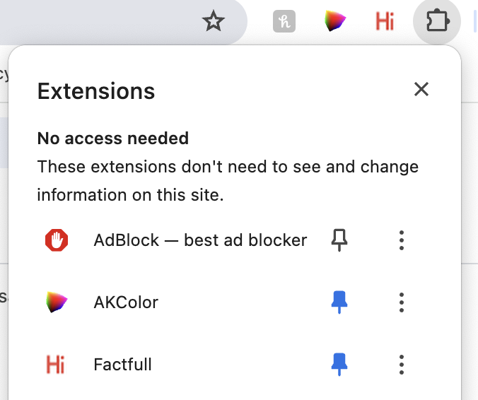
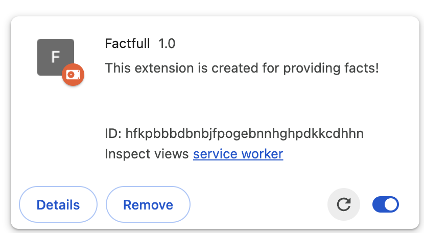

# Factfulness Google Chrome Extension

Google docs description [here](https://docs.google.com/document/d/1tOD9gMZ2RdEK8HbkXcqhOkXQp_Uo6h9kooIjMj8oPHY/edit?pli=1) 
## How to launch on your local browser
### Create the folder "dist" with all the necessary files
You can do this through github actions: 
1. Click on "Actions" tab in Github tabbar.
2. If "All workflows" is empty, or you want latest possible version, click "Create Extension Zip file on the left"
3. You'll see "This workflow has a workflow_dispatch event trigger." Click "Run worlflow" button to the right.
4. Make sure that branch is set to "main" and click green "Run worlflow" button.
5. Wait. Workflow will start in a few seconds.
6. When workflow is done, click on it, scroll down and click on "extension-zipped" in "Artifacts" table
7. Unzip downloaded zip-file to any directory you prefer

### Upload dist directory to Chrome Extensions
1. Go to Settings -> Manage Extensions
2. Click on "Load unpacked" 
    
3. Choose dist folder, unzipped in previous guide
4. Make sure that your extension is pinned for easy access
    
5. If you want to update to newer version, simply remove previous dist folder, set new one and click reload button.
    

> NOTE: be aware that you are not publishing extension, you only adding it to your own browser
